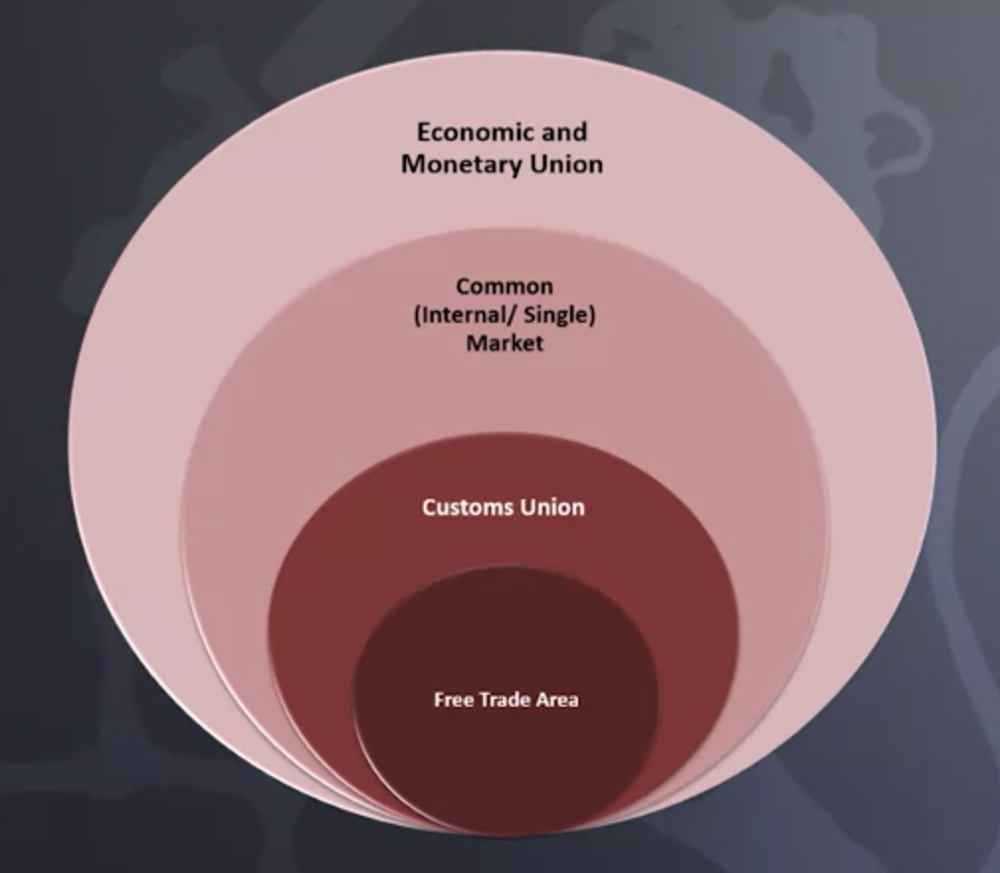

# **European Business Law (Module: European law fundamentals)**

<cite>Source: <https://www.coursera.org/learn/european-law-fundamentals> (Lund University)</cite>

## **Week 1. Introduction to EU Law**
### **1.1 Overview**
- History of the European Union
- Overview of main institutions of the EU
- The Court of Justice of the European Union (CJEU) as the most important EU institution
- TEU: the treaty of the EU, sometimes referred to as the constitution of the EU
- TFEU: the treaty on the functioning of the EU: preamble and section 1 to 4 - EU principals, union policies and internal actions
- TFEU: section 5 to 7- commercial policy, cooperation, with third countries, financial and general provision
### **1.2 History of the European Union**
- TEU and TFEU are also referred to as “Lisbon treaty” and in substantial parts are based on the former so called “Rome treaty” (1958) and mitigating the problems created by the treaty of Versailles (established after WW1) to wove Germany into a European partnership
- European of federalists was a think tank established in 1946 entailing the founding of organization such as the IMF, UN or General Agreement on Tariffs and Trade (GATT) and most importantly, the CoE (incl. the European convention of human rights that established the ECHR)
- Collaboration of coal & steel community can be traced back to the so called Schuman declaration (1950) to make war materially impossible, ensuring common oversight of the defense industry that lead to the creation of European Coal and Steel community(ECSC) in 1952
- Also 1952 the European Atomic Energy community was established (in the course of the treaties of Rome)
- First revision of the treaties happened in 1987 with the European Single Act (more efficiency, more competency e.g. for environmental protection), then treaty of Maastricht in 1993 (change of the name of EEC to EU and intro of Euro, expanding of competencies in Justice and Human Affairs) and treaty of Amsterdam (1997),the the treaty of Nice (2003) that expanding voting rights after unification of West and East Germany while the treaty of Nice created a Charter of non-binding Charter of Human rights. The current versions of TEU and TFEU (the “treaties”) were eventually adopted in the treaty of Lisbon in 2009, failing to adopt the EU constitutional treaty but strengthening the power of the European Parliament (EP) and making the Charter of Fundamental Rights binding.
- In 1958 the treaty of Rome lead to the creation of the European Economic Community (EEC) among the people of Europe to preserve and strengthen peace and liberty
### **1.3 Overview of the main institutions of the EU**
- Institutions (Art. 13 TEU)
  - Main institutions
    - European Parliament (EP) – Art. 14 TEU
      - Is directly elected by the citizens of the EU and has parliamentary functions: political control and legislative power but no right to initiate legislative process
    - European Commission (EC) – Art. 17 TEU
      - Has the right to initiate legislative process (proceedings, such as TFEU that has been reached)
      - Elects the president
      - Has budgetary rights
      - 28 independent members, one commissioner from each member state
      - Proposes new legislation
      - Guardian of the treaties
      - No strict separation of powers, EC has been described as executive organ.
    - The Council of Europe (CoE) – Art. 16 TEU
      - Resides in Strasbourg and comprises 46 countries of Europe. 
        (It was set up to promote democracy and protect human rights and the rule of law in Europe)
      - Consists of ministers from each EU member state, grouped by subjects, such as agriculture, environment, foreign affairs, etc.
      - Adopts EU law
      - Adopts budget together with parliament
      - Covers many fields, such as internal market, agriculture, etc.,
    - Court of Justice of the European Union (CJEU) – Art. 19 TEU
      - Observes the law
      - interpretation and application of the treaties
      - Consists of the court of justice, the general court and specialized courts
    - European Council (EUCO) – Art. 15 TEU
      - Institution of the European Union, consisting of the heads of state or government from the member states together with the President of the European Commission, for the purpose of planning Union policy (...from wikipedia)
      - Difference to the CoE is that it consists of heads of state as opposed to ministers
      - Sets out the general guidelines for EU policy
  - Other institutions
    - European Central Bank (ECB)
    - European Court of Auditors (ECA)
    - Institutions (Art. 19 TEU with details)
      - European Ombutsman: appeal for citizens and entities for malpractices
      - European External Action Service (EEAS)
  - External relations
    - European Economic and Social Committee (EESC)
    - (European) Committee of the Regions (CoR)
      - Advise on social, economic or regional matters
  ### **1.4 The most important EU Institution: The Court of Justice of the European Union (CJEU)**
- Judicial branch of the EU (judikativ / gerichtlich) – Art. 19 TEU
- Observes the law
- interpretation and application of the treaties
- Consists of
  - the European Court of Justice (ECJ - not to be confused with the CJEU) -  from 1953 to 1988 the only court of the CJEU
    - Highest court of the EU
    - Has 28 judges, one for each member state
    - Many functions, e.g.
      - Rules on appeals against decisions of the GC
        - Rules on Infringement proceedings brought up by Commission where it believes EU law has been breached
        - Rules on preliminary references, i.e. on questions of interpretations of EU law asked by national courts or tribunals
        - Rules on validity of acts adopted by the European institutions
        - Rules on damages claims against EU institutions
        - Can provide opinions on wether international agreements envisaged by the EU are compatible with treaties (Art. 281, §11)
      - Is assisted by advocates general (independent legal expert)
        - An advocates general provides advise (called opinion) to the court usually before the ECJ decides
          - Opinions are discussions on reasons based on the case and previous case law
          - Previous case law is the main source for decisions (similar to the common law method) and
          - Opinions propose a particular decision based on discussions
          - ECJ has no obligation to follow opinion, but mostly it does
        - Cases before 1988 have a case number and the year of the decision: e.g. 1/73 is the first case that arrived at the ECJ in 1973
        - Cases after 1988 are prepended with a C, e.g. C1/89 is the first case that arrived at the ECJ in the year 1989
    - the general court (GC) – exists since 1988
      - Court of first instance, e.g. if one ants to challenge an EU measure one would typically first apply to the GC
      - Has at least 28 judges, at least one for each member state
      - Cases are prepended with a “T"
    - specialized courts
      - civil service tribunal (employment disputes)
      - established in 2005
      - Cases are prepended with an “F"
  ### **1.5 TEU: the treaty of the EU, sometimes referred to as the constitution of the EU**

- Largest combined economy in the world
- Guiding principals (promote peace n the world) through
  - Freedom
  - Democracy
  - Respect for Human Rights
- EU collaboration based on treaties
  - Treaty of Rome in 1957 established the EEC btw. The original 6 member states
  - Multiply revised to an “ever closer union”
  - Treaty of Lisbon 2007
    - is the fundamental revision: efficiency, more democratic, easier to enlarge and objection to term “federalism” and “constitution”
  - At present: three primary set of legislation
    - TEU
    - TFEU
    - Charter of fundamental rights (“the charter”)
  - TEU in details (parts of the treaty):
    - Common provisions (values) – Title I
      - “ever closer union” based on
        - Freedom
        - Democracy
        - Equality
        - Rule of law
        - Respect for human rights
      - For a society with
        - Pluralism
        - Non-discrimination
        - Tolerance
        - Justice
        - Solidarity
        - Gender equality (male & female)
      - And the aims of
        - Peace and well-being
        - Area of freedom, security, justice without internal frontier
        - External border controls
        - Rules on asylum and migration
        - joined crime prevention
      - Promoting an internal market with
        - Sustainable development
        - Balanced economic growth and price stability
        - Full employment
        - Environmental protection
        - Respect of rich cultural and linguistic diversity
      - In Art. 4 – 8
        - Solidarity
        - Subsidiarity (...from wikipedia: performing only those tasks which cannot be performed at a more local level.)
        - Proportionality
      - Art. 6
        - Charter of fundamental rights
        - Convention of Human Rights
        - And general principals stemming therefrom
      - Democratic principals – Title II
        - Art. 9 -12
          - Members of the EP can be directly elected
          - Other representatives are chosen by the governments of the members states
          - 1 M citizens or nationals of a significant number of member states may invite the EC to submit proposals for implementing the treaties
        - Art. 13 – 19
          - Establishes the institutions: EP, EUCO, CoE (“Council”), EC, CJEU, ECB, ECA
          - CoE → representations of member states retains competence in legislative and budgetary matter often shared with the directly elected EP
          - EUCO → new legislative proposals and is the main supervisory body, controlling that member states and individuals are meeting their obligations under the treaties
          - CJEU → interpreter of the treaties and guardian of the rules of the law in the EU
        - Enhanced cooperation – Title IV (Art. 20)
          - Rules for deadlock situations in initiating collaborations, e.g. monetary collaboration (Euro Zone) or European common patent protection
          - A reduced number of member states may initiate collaboration if it furthers the objectives of the EU, protects its interests and reinforces its integration process
          - Any collaboration is open to all non-participating member states at any time
        - External actions (Art. 21 – 46)
          - Chapter 1: EU’s foreign policy (some principals as the union itself)
          - Chapter 2: EU’s specific provisions of the common foreign and security policy
            - military cooperation, in particular mutual defense
            - Peace keeping
            - Conflict prevention
            - Strengthening of international security
            - Operational is shared among members
              - Such as the obligation of assistance in case one member is victim of armed aggression (Art. 42)
              - In 2015 France required assistance for the first time (Only Finland did deny the request as in conflict with national law)
          - Final Provisions (Art. 47 – 55)
            - Art. 47: EU has legal personality
              - EU may own and dispose property
              - EU has capacity to appear in legal proceedings
              - EU may become party in international collaboration
            - Addresses amendments to treaty previsions
            - Rules for accession of new member states
              - New member state must accept fundamental values laid down in Art. 2 TEU
              - Needs to be ratified by all other contracting states
            - Rules for withdrawal of existing member sates
              - The Rome treaties of 1957 contained no withdrawal previsions
              - In 1984 Greenland was accepted to withdraw as an exception
              - TEU Art. 50 contains now such previsions and has been activated by the Brexit application for the first time
            - The remainder of the final provisions contain
              - Attached protocols
              - Geographic application of the treaty
              - The treaty’s unlimited duration
              - Ratification procedure
              - Different language versions: latin, english, french, german
### 1.5.1 **Summary:**
#### 1.5.1.1 ***European Law***
- is a system of rules operating within the member states in parallel with their respective national rules
- to achieve peace and social justice for its people and the global community
- represents a new legal order based on the treaties
#### 1.5.1.2 ***EU is***
- Not merely an economic union
- aims to ensure social progress and seek constant improvement of living and working conditions of their people
- New members may join if agreeing to the values and principals of collaboration
- Members may leave, but the process is complicated
- People are entitled to participate in a representative democracy through the directly elected European Parliament
- EC has the legislative initiative
- CeE represents member states governments and has the main decision making power
- CJEU upholds the rule of law
### 1.6 **TFEU: the treaty on the functioning of the EU: preamble and section 1 to 4 – EU principals, union policies and internal actions**
- 7 parts divided into chapters, titles and sections → 358 Articles
- Whereas TEU used to be called the constitution and TFEU is more operational and is meant to facilitate the European Collaboration
- Preamble
  - Practical aspects for common actions and removal of barriers for an “ever closer union”
  - That shall guarantee a common commercial policy, steady expansion, fair competition
- Part I & II
  - Art. 1 – 25
    - Principals were discussed for TEU
    - TFEU addresses categories of union competences
    - TFEU addresses general aims
      - equality of men and women
      - High level of employment
      - Adequate social protection, education and training, and human health
      - Environmental and consumer protection are to be integrated into all union activities and policies
    - Art. 18 – 25
      - Principal of non-discrimination was discussed for TEU
      - Makes every person holding a nationality of a member state a citizen of the union
    - Part III
      - Art. 26 – 197: Union policies and international action
        - longest and most detailed section of TFEU: 24 subtitles & 171 articles
        - EU business law
          - Defines the internal market: area without internal frontiers, free movement of goods, persons, services and capital
            - Restrictions may be imposed in the context of public morality, policy, security, protection of health & life, industrial & commercial property or exercise of official authority
              - Restrictions must not constitute means of arbitrary discrimination or disguised restriction on trade
            - Free movement of goods (Art 24 – 38 →  TODO: check TFEU if this is true)
              - Customs on third country goods are established and collected by member states
              - restriction on internal trade are prohibited (or measure with equivalent effect)
              - Art  38 – 44 extend the freedom of goods to agriculture and fishery, differentiating btw more industrialized and farming (rural?)l areas
            - Free movement of persons and abolition of any discrimination based on nationality (Art. 45)
              - Rights of workers
            - Free movement of establishment (based on Art. 49)
              - Individuals and companies are free to setup agencies, branches and subsidiaries
              - Shall have same legal status as nationals of member states
            - Free movement of services (Art. 56)
              - Restrictions on freedom to provide services for renumeration / compensation shall be prohibited
            - Freedom of capital & payments (art. 63)
              - Restrictions on the movement of capital are prohibited
              - Member states may prevent tax infringements in national law of other members → supervision of national financial institution
            - Title V (Art. 67 – 89) – Union as an area of freedom, security and justice
              - Policies on border checks
              - Asylum and immigration
              - Judicial cooperation in civil sector
                - Principal of mutual recognition
              - Police cooperation
            - Freedom of goods (free flow of goods)
              - Internal transport (Art. 90 – 100)
              - Common transport policy an improve transport safety
                - Discrimination in the form of state subsidiaries or carries who charge non-reasonable, competitive rates are prohibited
                - Special rules for sea and air transport
              - Common rules on competition (Art. 101 – 109) → important for industry and commerce  (EC and national competition agencies cooperate are primary guardian of the EU competitive climate → regulatory and case law provide concrete examples of unlawful activities
                - Direct effect and strictly enforced → can mean high penalties for companies
                - Art 101: prohibits and sanctions – individually or in group – any distorted competition laid down in agreements that are null and void, if
- Fixing prices
- Limiting production and technical development
- Limiting market market sharing
- Any discrimination
- Tying activities (...from wikipedia: product tying is the practice of selling one product or service as a mandatory addition to the purchase of a different product or service)
  - Art. 102: prohibits any abuse of dominant position if it affects trade between member states (similar to Art. 101)
- No exemption policies for abusive behavior
- A dominant company has the special responsibility to compete on the merits
  - Art. 106: Rules also apply to public undertakings but rules must not obstruct the performance of the particular task at hand
  - Art. 107 – 109: Deals with state aid that most not threaten or distort competition
  - Art. 110 – 113: tax and harmonization, primarily a national matter with certain common rules to avoid taxation distorting trade and discriminate non-nationals
  - Art. 114: EC proposals must be based on a high level o health, safety, safety, environmental and consumer protection
  - Art. 115: The CoE shall issue directives for harmonization of national laws if they pertain the functioning of the internal market
- promote further integration
- A directive that has not been implemented on the national level may create rights for individuals after the implementation time has elapsed
  - Art. 118 (is new): intellectual property rights and the need for common rules and organizations
  - Art. 119- 144: economic & monetary policy
- Economic activities
- budgetary discipline
- Depreciation of currency must not distort the conditions in the union
- stipulation on Euro in terms of exchange rate policy for price stability and to support open market and free competition
- Support the open-market economy with free competition
  - Art. 145 – 166: employment & social complement the free movement of persons
- Union shall contribute to high level of employment by encouraging collaboration by supporting member state actions
- Art. 145: coordinated strategy for employment
- Art 153: working environment → safety and health of workers, working conditions, social protection, collective defense of interests (unions), gender equality in labour market
- Art. 157: equal pay for equal work or work of equal value for male and female
  - Art. 167 – 169: Public health & consumer protection
- Art. 168: high level of human health protection shall be ensured in ll union policies
- Art. 169: protection of health, safety and economic interests of consumers
- Art. 12 (TFEU): consumer protection shall be considered in other union policies as well
  - Art. 179 – 189: research & technology → union shall be more competitive than any other region”
- Art. 179: union must strengthening its scientific and technological bases → scientific knowledge and technology may circulate freely
  - Art 192 – 193: environmental policy →especially,  combating climate change
- Protect and improve quality of the environment
- Human health protection
- Prudent / rational utilization of natural resources
  - Principals:
- Precautionary principal
- preventive actions
- rectified at the source
- polluter pays
  - Art 11 (TFEU): environmental requirements must be integrated into all union policies and activities, promoting sustainable development
  - Part V: common commercial policy and cooperation with third countries
    - Art. 207: shall be based on conclusions of trade agreements: trading goods and services, commercial aspects of intellectual property, foreign direct investments
    - Art. 208: union development policy: reduction and eradication of poverty in accordance with the UN
      - Humanitarian aid for ad hoc assistance such as natural or man made disasters in accordance with international law and with the principals of impartiality (impartiality), neutrality and non-discrimination
      - International agreements (reciprocal rights & obligations)are binding for the member states and the union
    - Art. 222: solidarity clause
      - Union and member states shall act jointly, given
- Terrorist attack
- Victim of a natural or man-made disaster

→ All instruments including military resources shall be provided in an act of solidarity

→ Protect civilian population & democratic institutions from any terror attack

- Part VI: institutional and financial provisions
  - Title I  
    - Art 223 –287: institutional provisions (See TEU in (2))
- TFEU deals with the previsions for the institutions compositions and competences
  - Art. 288 – 292: legal acts of the union
  - Art. 288: contains
- Regulation:

→ have general application

→ are binding

→ directly applicable

- Directive

→ Results is binding, but member state has the choice of form and methods

- Decision

→ Binding in its entirety

→ If specified, then only binding to the addressee

- Recommendations & opinions

→ No binding force

- Art 293 – 299: legislative procedure
- Art 294: ordinary legal procedure
- First reading

→ EP adopts its position and communicates it to the CoE

→ If the CoE approves the proposed changes then the act is adopted

→ If the CoE does not approve the changes then this is communicated back to the EP

- Second reading

→ If the EP does not approve or not that action within 3 months then the act is adopted as proposed by the CoE

→ If the EP rejects the act, the act falls

→ If the EP again proposes amendments then the new text goes back to the CoE

→ CoE either approves the amendments or calls for a conciliation meeting

→ If the conciliation procedure is successful then (CoE and EP agree) the third reading is initiated

- Third reading

→ Exists to finally adopt the act in case reconciliation procedure of second reading is successful

- Adopted legislative acts are published I official journal of the EU

→ Going into effect on the day specified or on the 20th day after publication

- Art. 310 – 325: financial provisions
- Based on Own resources and contributions of member states the EP and CoE shall

→ Establish the budget

→ and supervise the budget implementation by the EC (budgetary rights)

- Part VI (Art. 335 – 35): general and final provisions
  - General Stipulations (Vorschreibungen)
- Art. 335: unions legal capacity
- Art. 340: responsibility for damages
- Art. 339: staff confidentiality provisions
- Art. 346: Measures contrary to essential interests of a member state
- Art. 147: General force majeure (höhere Gewalt)
### 1.6.1 **Summary: TEU and TFEU**
- EU’s own legal order
- TFEU outlines rights and obligations for states, companies and individuals
- Precedence in case of conflict with national legislation→ Quiet unique among international agreements
## **Week 2. Sources and Methods**
### 2.1 **Intro to EU Law Sources**
- OJ: Online Journal of the EU (until 2003: OJ of the European Community), publish Tuesdays to Saturday each week
  - L series: contains publications of mostly secondary legislation, that is
    - Regulation
    - Directives: legal act that set out a goal that all EU countries must achieve, and shall be implemented into national law within a certain timeframe. How this is done is up to the countries.
    - Decisions: are binding for the addressee and directly applicable
    - Recommendations

→ Example reference: OJ L 376, 27.12.2006, p. 36-68 (see style guide for how to cite L series publications)

- C Series: primary legislation, i.e. treaties, protocol, charter, that is  information from main institutions (Assumption of mine → “C” stands for Commission)
  - Notices, guidelines, announcements
  - Resolutions, opinions, joint declarations
  - Preparatory acts
  - Summaries of judgements

→ example reference: see above but usage of “C”

- EC: European Court reports (ECR) from the ECJ – official name: report of cases before the Court of Justice and the General Court (After 2012, only digitally published)
  - Judgements of the three types of courts incl. Specialized courts such as civil service tribunal
    - Opinions
    - Orders

→ example Reference

- Before 2014:
  - ECR 2004 p. 1-04135 Part I: Court of Justice
  - ECR 2004 p. 11-04135 Part 2: General Court (Court of first instance)
- After 2014, the following convention:

Name of judgement
Number in the register (Case Number), ECLI Number (European Case Law identifier), paragraph

- E.g.

**Judgement in Schempp
C-403-03, EU:C:2005:445: paragraph 22**

- EUR-LEX (Legal database of the EU) – all document can be found there in all official languages
  - OJ since 2013 the authentic articles only in EURO-LEX
  - EU Law, incl. Consolidated legislation
  - Preparatory acts and legislative history
  - ECRs in pdf (beginning from 1970)
  - international agreements

→ One can be sure to get the correct version of the document as opposed to a working version with e.g. Google

- Curia: Additional database of the ECJ, in all official languages
  - Contains cases of a three courts of the ECJ
  - Opinions of the Advocates General
  - Notes from the Academic Writing
  - Press releases about new cases
- Europa.eu, all official languages
  - Each institution has its own homepage, such as the EP and the EC (mainly English, German or French
  - Can be browsed also by topic, such as the “internal market” topic
- “News Room”
  - Press releases
  - Example reference of a press release of the EC itself: IP/03/43
### 2.2 **Practical introductions into various treaties; regulation, directives and decisions**
- Treaty: binding agreement btw. union members
  - Set out objectives
  - Rules for EU institutions and how decisions are mad
  - Relationships btw EU and its member countries
  - Treaties currently in force and available o EURO LEX:
    - Treaty of Lisbon
      - Consolidated versions of
        - TEU
        - TFEU (contains the table of articles for a mapping from old (=Treaty of the European Community (TEC)) to new numbering)
      - Treaty establishing the European Atomic Energy Community
      - Charter of fundamental rights of the EU
- Secondary Legislation revisited
  - Regulation: binding legislative act and must be applied by all members in its entirety
    - Convention for references

`		`Institution (EC or EU) Number of Act/year of acceptance; EC stands 			for European Community in this case; EU is used after Lisbon treaty in 			2009, resp.

- E.g.

`			`**Council Regulation (EC) No 1/2003**

- In the EURO LEX database, each article
  - is prefixed with a European Union wide unique identifier called CELEX number in the search results
    - If CELEX starts with “3” then the search result pertains a regulation
      - Contains a reference to the OJ, such as OJ L 1, 4.1.2003, p 1-25 postfix with the language code the regulation is available in the OJ
      - A direct link to the original text → If the text has changed then the changes can be seen only in the consolidated version TFEU which might have changes that only concern a certain country
      - Each search result has details (Tabs in the UI)
  - with references to related article
  - Article that reference the search result
  - Amendments and who amended and proposed these
    - Contains a legislative drafting guide → guidelines on how to read legislation / the act
  - Title:
    - identifier
      - plus certain technical data such as authentic language, serial number, etc.
  - Preamble: everything between the title and the enacting terms, that is,
    - Citations, recitals (Rezital==Erwägungsgrund) and solemn forms (feierliche Erklärung)
  - Enacting terms
    - constitutes the legislative part of the act
    - Composed of articles that may be grouped in titles, chapters, sections and may be accompanied by annexes
- Directives: legal act that set out a goal that all EU countries must achieve, and shall be implemented into national law within a certain timeframe. How this is done is up to the countries.
- Decisions: are binding for the addressee and directly applicable
- Case Law
  - Example reference: C-341/05
    - C for Court of Justice, T for General Court, F for Civil Service Tribunal
    - serial number
    - slash
    - Year
  - ECLI: European Case Law identifier (Includes European and national courts)
    - Build to improve case search
    - Example reference: EU:C:2007:809
      - Country code
      - Code of court that rendered the judgement (C == Court of Justice)
      - year
      - Sequential number (can be decided by each member state and may consist of up to 25 alphanumeric characters)
    - Search result: since 2014 electronic report replace analog versions (see European Case Report (ECR) above for the format of a report’s identifier)
      - Court that rendered Judgement
      - Parties involved
      - Key words, relevant directives and articles
      - List of reports of Cases (for e.g. 2007-1-11676), that is, Judgements and opinions of the advocates general presented to the court before the judgement
      - Details
        - Citation of case law
        - Dates of importance
        - References like notes of academic writings or treaties, directives, etc.
        - And a procedural analysis such as e.g. names of judges
- Commission Documents (some documents are published only on the EC web page)
  - Proposals and new regulations of the EC are published in the COM Document series (EURO-LEX shows you institution and proceedings)
    - convention for reference:

`		`COM for official identifier of the EC, 2011 is the year of publication, 652 is the 		Document Number, final means it is the final version  

- E.g.

**COM (2011) 651 final 
(Document on market manipulation and market abuse)**

- Notices and guidelines for the EC (Can play important role in interpreting a regulation)
  - Only published in OJ
- Implementation reports on legislation (e.g. on the Services Directive – “working conditions”)
- COM documents can be found on EURO-LEX, OJ and on the ec.europa.eu webpage)
1.
## **Week 3. Fundamental Principals (EU Competences)**
### 3.1 **Core competencies**
#### 3.1.1 **Principal of conferral / Principal of conferred power**
**(Article 5 TEU: exclusive, shared and supportive)**

- EU can only act on the powers conferred on it
- Originally, the Member States had to limit there sovereign rights/powers and transferred these on to the EU
  - Transferred powers define the competences of the EU in these areas on top of a legal base
    - A legal base is defined by (delimitation of competences)
      - Who has the competence to act (EU institution or member states)
      - When are the Who competent to act (under which conditions)
      - How (correct procedures)
  - Originally the delimitation of the of the competences had not been formally defined in the treaties
    - Courts were to interpret the relevant treaty provisions on a per case bases
  - Treaty of Lisbon (2009 codified the different types of competences that the EU can have)
    - Exclusive competency (Art 3 TFEU → e.g. customs union): Only the union can adopt binding acts
    - Shared competency (Art. 4, e.g.  internal market, environment, consumer protection, social policy)
      - Shared != member & union can legislate at the same time
      - Member states can legislate to the extend that the union has not yet exercised its competence in the particular area
      - As soon as the EU legislates in a particular area, member states no longer have competence to legislate in this area

→ “Preemption of member states competencies”

→ Only those competencies that are not mentioned in the treaties remain in full control of the member states

- Supplementary / supportive competency (ergänzend) (Art. 5 and 6 TFEU) → Supplementary is not the same as supportive!
  - e.g culture or tourism
  - Support, coordinate or complement the a member states actions

→ Note:

- there is no 1-to-1 relationship btw. Competency and area such as the environment
- Some competencies are set out in very general terms: horizontal competencies (competency can be stretched far and may touch many policy areas), such as the competence of regulating the internal market (Art. 114 TFEU)
- Example: EU introduced measure for the prohibition of “Swedish snooze”
  - Producer challenged the measure on the bases that this concern public health but not the internal market → argument: EU has no competency to regulate as no competence in public health
  - At this time, some members had already introduced some measure to regulate Snooze and some members were considering measures
  - This means that the member state’s markets differed at that time which could potentially create barriers in the internal market
  - To remove the risk of market barrier, common rules were introduced for tobacco products in general to maintain the functioning of the internal market
    - The EJC held that the objective of this measure was not public health but functioning of internal market
    - So Art. 114 indeed applied as a legal base
    - The measure does concern public health but was introduced under the horizontal competency of the internal market

→ This type of reasoning was used in many controversial measures adopted by the EU

→ The principal of conferral is therefore a very open-ended competency where the principal of subsidiarity comes in:
#### 3.1.2 **Principal of subsidiarity**
- Question is not if a competence is available in a certain area (is already answered by principal of conferral)
- Subsidiarity is about at which level action conferred by a competency may be applied
- EU should not take any action if the objectives of a measure can be better achieved on a national or regional level (https://ec.europa.eu/eurostat/web/regions-and-cities)  
- So under the principal of subsidiarity the member sates are the default actor unless there are reasons why the EU should step in

→ The EJC was reluctant in the past to accept restriction on EU level based on the principal of subsidiarity if there was a competence available in the treaties

- See Snooze example illustrating that there are often multiple competencies available for a proposed measure, dependent on the specific objectives mentioned in the measure
  - e.g. if objective is “public health”, the “internal market” would not be applicable as opposed to objective “internal market” that implies the harmonization of the member states laws in that area
  - Therefore, challenges against measures deduced from the competency of conferral or competency of subsidiarity hardly succeed → More successful is challenging the choice of legal bases  of a particular measure rather than arguing that there is a complete lack of competency

→ The principal of conferral and subsidiarity only deal with what  the union can do,

→ How the union should deal with measures and objectives is defined by the principals of proportionality and non-discrimination
### 3.2 **Effects of EU law, i.e. using the competencies – What actually is EU law?**
- EU law can be seen distinct from national law, a legal order that interacts with national law (overlap)
- EU and National law contains different legal instruments
  - National law: hierarchical norms, such as constitution, laws, administrative decisions, etc.
  - EU law
    - Primary law (higher normative value) → usually comes about through agreements of sovereign member states
      - TEU and TFEU, and Charter of fundamental rights
    - Secondary law
      - Produced by EU institutions: mainly CoE, EP, and EC
      - Art 288 TFEU defines
        - Regulation (binding, i.e. legislative)
        - Directives (binding, i.e. legislative)
        - Decisions (binding), i.e. legislative
        - Recommendations (non-binding, i.e. non-legislative)
        - Options (non-binding, i.e. non-legislative)
    - Direct applicability and the mechanisms that make EU law relevant for individuals, companies and member states
      - Only regulations are said to be directly applicable in its entirety
        - Why? Because historically, regulations are part of international law which is very different from national law
        - If international law is applicable in a sovereign state is up to the state at hand, i.e. if and how international law should be applied
        - Traditionally, states have treated international law in very different ways
          - Some states as directly applicable, some requiring the transposal of the international law into national law before applied
          - Hence: founders of the EU set out that some EU law is exclusively directly applicable → regulations need not and should not be transposed to national law
        - Directive are binding as to the result and addressed to the member states, i.e. the end is binding and not the means
          - Based Van Gend & Loos, C26-/62 the ECJ introduced the principal of Direct Effect (without any clear legal bases in the treaties) and is defined as the capacity of EU law to give rise to rights and obligations directly without the need of further implementation → This means individuals, companies and institution should be able to invoke and enforce provisions of EU law in their respective country with direct effect in the national context
          - Direct effect != direct applicability → direct applicability is not by itself a prerequisite of direct effect
            - A particular provision of EU law can be deemed to have **direct effect** although the legal instruments where the provision can be found it is not a regulation if
              - Provision has to be clear and precise (no ambiguity on requirements) → clarity of language (c**lear**)
              - Must contain an unconditional right or obligation → clarity of right or obligation itself (p**recise**)
              - Provision shall not be dependent on implementing measures → this would mean Directive could never have direct effect! (**unconditional**)
          - Effective EU law == Primacy + Direct Effect
          - Horizontal direct effect
            - private party ↔ private party → There can be **no** direct effect flowing from private parties in a Directive
          - Vertical direct effect
            - State ↔ private party → There can be a direct effect flowing from State to private party in a Directive, at least then if the previsions is invoked by the private party against the state
              - The member state (so any public administration) must not benefit from neglecting to implement a Directive correctly → based on the Estoppel Principal: nobody shall benefit from their own misconduct
          - ECJ has rules that Directives cannot produce direct effect
          - Primacy, i.e. principal of primacy of EU law (Costa vs. Enel judgement: C-6/64)
            - Means that EU law has higher normative value and therefore has to be given effect even if a contradictory national law exists
            - Even if an EU law has no Direct Effect, Primacy can still play a role: implies an EU conform interpretation (laid down  in the Marleasing judgement C-106/89) → all national rules must be interpreted in light of **ALL** EU law not just the law at hand
          - Decisions are binding in its entirety
### 3.3 **The principal of fundamental rights**
- Since the 1970s the principal of fundamental rights has become a key corner stone of the internal market
- Fist Commissioner Walter Hallstein in the 1950s (EU was still EEC) coined the term Rechtsgemeinschaft
- Art 19 TEU: meant to establish the rule of law in the European Union, ensuring
  - Law is observed
  - Effective legal protection
  - Protection of fundamental rights
  - Members are to remedy to ensure effective legal protection in the fields covered by EU law
- Art 6 TEU: contains the framework for the fundamental rights, with four levels of protection (plenty of case law exists)
  - Provision Art. 6.1 TEU: Charter of fundamental rights containing the fundamental rights catalog with the same value of the treaties themselves
    - Was proclaimed in Nice on  December 7, 2000 and became binding with the enforcement of the Lisbon treaty in December 2009
    - According to Art. 51 of the charter it applies only when EU law is applicable and when the EU member states apply EU law
    - If the charter applies it is binding on the EU institutions as well as on the national institutions and administrations, that is the ECJ and national courts, the EC and the national competition authorities, etc.
    - While all rights are carrying a different meaning and different effects the charter consists of
      - hard rights
        - Physical integrity of individuals
        - Protection from arbitrary interventions by the state on the freedom of individuals (right to dignity, life, ban of torture, ban of capital sentences
      - soft rights: related to the organization of society and social aspects of life, which can also be (re-)found in directives adopted by the EU legislator (coherence). There is a distinction between framework directives and specific directives while framework directives are not specific enough to have direct effect and imply therefore that corresponding right in the charter is also weaker
        - Right to a paid holiday
        - Right to fair working condition
        - Right of workers to be consulted
    - In Art. 52 § 5 the charter distinguishes btw rights and principals → Down to now, it is not clear how this distinction should be made
    - The charter contains many rights that have been inspired by other documents such as the European Convention of human rights, so the convention of human rights in not exclusively applicable under article 6 TEU. One reason for that is the coherence int the application of fundamental rights.
      - Those rights that correspond to right in the convention of human rights must be interpreted in the light of that convention (compare framework directives above). The EU my provide a higher level of protection than the convention of human rights which follows from Art. 52.3 of the Charter

→ Therefore, the convention of human rights has a specific place in EU law: Art. 6.3 TEU – ECHR → convention of human rights has been applied by the ECJ as human rights standard for quiet some time now

- Provision Art. 6.2 TEU: the future accession of the EU to the convention of human rights
  - The convention form a sort of minimum level (Art. 52.3. of the charter). This was not enough and it was decided that the EU should become a member of the CoE (accession treaty)
  - An important aspect here is the design of the judicial structure of the relationship btw. ECJ In Luxembourg and the ECHR in Strasbourg.
  - The negotiations for the accession are well under way. On 5th of May 2014 ECJ had its hearing on Opinion 2 of 2003 → If the ECJ agrees to the draft accession treaty, then the EU may exceed to the convention very soon

→ Personal note:

- has not happened yet: https://www.coe.int/en/web/human-rights-intergovernmental-cooperation/accession-of-the-european-union-to-the-european-convention-on-human-rights
- On 16 March 2022, the Committee of Ministers decided under Article 8 of the Statute of the Council of Europe that the Russian Federation would cease to be a member of the Council of Europe forthwith.
- Provision Art. 6.3 TEU: principals and national constitutions
  - protection of fundamental rights through general principals of EU law, however no change of the level of rights protection is implied
  - According to Art 4.2 TEU the EU must respect national identity and according to Art. 6.3 TEU as well as Art 52.4 and 53 of the Charter nation constitution play an important role in the fundamental rights protection
  - But: if a constitution would ever affect to primacy, unity and effectiveness of EU law in the face of harmonizing measures of mutual recognition, national constitutions must give way to the effectiveness of EU law
  - Application of fundamental rights by national courts through national constitutions
### 3.4 **The principal of proportionality**
- Relevant for every single aspect of EU law
- Choices must be made on evidence
- EU law is based on parallel application of EU law and national law
  - Therefore compatibility assessment: balancing of different interests and different results, balancing of
    - primacy, unity and effectiveness of EU law and
    - the principal of subsidiarity and conferral
    - That is, assess the legality of an exercise of power where a legitimate aim is pursued but other objectives deserving of protection are damaged
    - Balancing the legitimate aim the protection objectives is done by applying a model of that is derived from the German constitution, that is a conducting a proportionality assessment and taking into account
      - Fundamental right
      - The four freedoms
      - Labor law		
      - Etc.
- Principal of proportionality: assess national measures in the light of EU law and applies in all fields of EU law (fundamental rights & EU legislation, as laid down in Art. 5 TEU)
  - Assessment through proportionality test that follows transparency & self control (a reason for decision is required by the judges) and consists of 3 steps
    - illustrated by the Example case Dirextra C-523/12 from Italy
      - Italian legislation provided funds to higher education at master level, if the institution had 10yrs experience
      - Question arose if this legislation restricts the freedom of establishment of the EU by limiting number of schools who may receive the funds
    - Step 1: Is measure appropriate?
      - Requires causal relationship btw. measure and objective (control if measure is arbitrary)
      - ECJ Margin of transgression for the national authorities concern (considers only whether there has been a manifest error)
      - Step 1 for Dirextra C-523/12:
        - ECJ found the aim of ensuring high quality of education (i.e. only experience institutions are allowed to receive the funds) appropriate
    - Step 2: Is measure necessary? (Dominant step)
      - Does the measure go further than necessary?
      - Are there other less restrictive measures, I.e. less detrimental to aims or interest protected by EU law that realize the same end? → balancing
      - Step 2 for Dirextra C-523/12:
        - ECJ found that since the national law was only applicable to master education but did not restrict the possibility to seek other educations, it could not be considered disproportionate
        - So the measure was compatible with EU law
    - Step 3: is proportionality proper?
      - Is sometimes overlapping with step 2
      - Rule of reason (judge needs to provide reason) if the measure would be manifestly inappropriate
### 3.5 **The principal of non-discrimination**
- DNA of EU law and pertains all of EU law, binding both member states and private parties in member states and both the EU and all its institutions (particular complex)
- Discrimination:
  - Treating alike cases differently or
  - Treating different cases alike
  - “Discrimination Test”: is the difference in treatment of objective substantial difference?
    - E.g. Motor cycles and Mopeds: clear difference in treatment as motorcycles may drive on highway while mopeds must not
      - However, there is no discrimination as there a substantial differences in a motorcycle and a moped in terms of speed (so motorcycle and moped are **not comparable** on a highway)
      - E.g. prohibiting mopeds to park on motorcycle parking lots may be discriminating, as a drivers of motorcycle and mopeds are in a (substantially) **comparable situation**
  - Primary law (i.e. TEU and TFEU) → Discrimination is prohibited on the grounds of
    - Nationality (Art. 18 TFEU)
    - Sex and matters of employment (Art. 157 TFEU)
    - Prohibition of any discrimination (Charter Art. 21) in terms of sex, race, color, political opinion, age, sexual orientation, etc.

→ are all expression of the general principal of equality or non-discrimination

- Case law shows that this principal extends to treatments on any grounds, e.g. treating steal producers differently from coal producers might be discriminatory which widens the range of arguments that businesses can use to challenge measure that mean a disadvantage for the business. However, the other grounds are much stronger.
- The principal is and was a key factor to building the internal market (e.g. treating EU citizens in another member states the same)
- Direct & indirect discrimination
  - Direct discrimination: if person is treated less favorably because of a status (grounds mentioned above)
    - E.g. A Greek law that said that only Greeks can be a captain or first mate, which meant discrimination of people of a Non-Greek nationality → ECJ ruled that this law was directly discriminatory on grounds of nationality
    - E.g. “buy Irish only”
  - Indirect discrimination (more subtle): if a requirement is imposed on person which appears to treat everyone the same, but in practice that is not the case (i.e. the result is discriminatory)
    - E.g. An Austrian law said that  in trading undertakings only managers may be appointed who were residents in Austria → ECJ found that this measure was indirectly discriminatory, because although no nationality was mentioned most non-residents were nationals of other member states
    - E.g. exclude part-time workers from pension scheme → women were indirectly discriminated, because much more likely to work part-time

→ However, not all differences in treatment qualify as discrimination (“Justified Grounds”):

- some member states have specific exemptions such as e.g.
  - rules for used cars that only apply to non-domestic cars only (public health justification) or  
  - Decisions to deport non-national EU citizens (public order justification)
- In addition member states may justify indirect discriminatory measures by reference to other objective requirements such as e.g. protecting the environment, protecting consumers and the like (in particular relevant for internal market)

→ All justifications must respect the principal of proportionality, and the fundamental rights

- Roles of the Principal of Discrimination
  - Market unifying Role→ removing differences of treatment can create barriers in the internal market
  - Market regulating role → fair competition should be guaranteed and distortions should be prevented, so not treating some actors differently than others
- Principal of Discrimination is grown beyond being a mere market principal, protecting the rights of EU citizen no matter if market actors and touches the scope of the principal of fundamental rights
### 3.6 **Principal of legal certainty**
- Implied by legal certainty is that rules are clear and precise such that is may be ascertained unequivocally rights and obligations to deduce steps accordingly
- Requires Foreseeability and Guarantees against arbitrariness
- Dependence on national system which may not be in line with EU law
  - E.g. a too restrictive national interpretation of a right and adapt national → can create uncertainty for individual what his/her rights actually are
    - Principal Primacy as a tool in the EU tool box can be used to resolve dissonance btw. EU provisions and national provisions
      - Dictates that national law must be interpreted as far as possible to comply with EU law
      - May even dictate that national law must be dis-applied

→Legal certainty is promoted, as EU should prevail in principal

- What is a general principal? Legal certainty can be used as
  - tool for interpretation → EU law as a whole must be interpreted that is compatible with the principal of legal certainty, I.e foreseeable for individual and member states concerned
  - tool / standard for judicial review → can be used as a legal benchmark assessing the compatibility of national law with EU law
- E.g. Retroactive penalty: a penalty that was introduced after an act was committed which would be deemed contrary to the principal of legal certainty, so EU provision would be invalid on this ground
- E.g. Defrenne VS Sabena Case 1976:
  - Defrenne took action against employer Sabena because of lower wage than male colleague, asking wether the treaty provision on equal pay would bind a private company and not only bind member states
  - ECJ gave positive response → equal pay for equal work
    - his had horizontal direct effect, and being ex tunc (von damals an), meaning that companies could be severely damaged. Therefore the ECJ decided based on the principal of certainty to limit the retroactive effects
    - This meant one could get compensation retroactively (in the aftermath) but only if the case pertained employment relationships from **after** April 8, 1976

→ Principal of legal certainty is often ensured by focusing on the uniform application of EU law (homogeneity across member states) and even national courts on the lowest level are obliged to a preliminary question to the ECJ on the validity of EU law (Art. 267 TFEU)

## **Week 4. Enforcement of EU Law and Judicial Review**
### 4.1 **Intro to enforcement of EU law and judicial review**
→ Enforcement of EU rights at the national level based on the principle of sincere cooperation, direct effect, indirect effect and state liability

→ Challenging a piece of inadequate legislation of EU level (Article 263 TFEU) and non-contractual liability (Article 340 TFEU)

- How is an individual or a company able to enforce rights at national or EU level or challenge an inadequate piece of legislation
  - EU confers rights for people and company (**challenge through enforcement** [on national level])
  - EU has certain powers conferred on it by member states hat may impose obligations on individuals or companies outside of these conferred powers (**challenge through judicial review**)
- procedures and condition that apply for a successful challenge
  - Enforcement of EU rights at national level
    - Primary and secondary legislations procuring rights and obligation
      - e.g. equal pay, or fair trial, implying an implementation on national level
      - Art. 4(3) TEU (subsection 3) and principal of sincere cooperation → member states are obliged to ensure correct implementation and application (application == give effect to EU law provisions) using 3 main mechanisms for enforcement:
        - Direct effect
          - Capacity for legal norms to be invoked and relied upon directly before national courts
            - direct effect for primary legislation and selected secondary legislation
              - Clear: clarity of language
              - Precise: clarity of rights and obligation
              - Unconditional: not dependent on implementing measures
          - Applies only to public sector
        - Indirect effect (== alternative route of direct effect is not applicable)
          - Obligation on the national courts to interpret national law conformant to EU law
        - State liability
          - Individuals and companies suffered damages when in breach to EU law
          - Compensation can be claimed from member state
          - Applies in the private and pubic sector (e.g. private and public employees)
      - Art 19(1) TEU: member states must ensure effective legal protection in areas covered by EU law
        - Member states are free to choose procedural rules for enforcement, but these are subject to
          - the principal of effectiveness: rules must not make it difficult / impossible to exercise EU rights)
          - the principal equivalence: rules should not be less favorable than those rules that relate to similar actions of domestic nature

→ E.g. Joined Case C-6/9-90: employer went on liquidation with some 			salary unpaid

- EU law gave guarantees to receive salary though but Italy had not implemented the pertaining Directive
- Enforcement
  - Direct effect: conditions for direct effect were not met
  - Indirect effect: no national legislation existed that could be interpreted in the light of the directive
  - National law: did not allow actions for damages against the legislator
  - Remedy of state liability was applicable, as Italy in this case had breached EU law

→ “effect util” of EU law: if individual/company could only rely on direct or indirect effect before the national courts but no compensation possible, then EU would not be effectiveness

→ State liability makes it possible for individuals/companies to rely independently of direct or indirect effect

- Directly challenging EU law on EU level (e.g. against competitive advantage or not respecting a right of an individual), i.e. judicial review:
  - Provision Art. 263 TFEU: challenge an EU measure entirely or in parts with the aim to declare the measure invalid→ Action of annulment
    - Scope of the review (What can be reviewed):any binding
      - Regulation
      - Directive
      - Decision
    - Grounds of review (Which reasons for a challenge)
      - EU has no competence to act
      - Or acted on an incorrect legal base
      - Infringement of of procedural requirement such as right to a hearing
      - Infringe to treaties or any rule of such as the principal of non-discrimination
    - Standing (Who is eligible)
      - Individual / company owner → option of subparagraph 4
      - If an individual is directly addressed then one always has standing (mostly not the case)
      - Proof Direct concern → direct link btw. Challenged measure and damage for applicant must be proofed
      - Proof individual concern (more difficult to proof)→ one must be part of a closed group with no potential to join
      - 2 month time limit for action after the measure has been published
  - Preliminary reference procedure, i.e. rules on questions of interpretations of EU law asked by national court or tribunal (see above)
  - Provision Art. 340 TFEU: Non-contractual liability (analogous to state liability)
    - However, takes place at EU level
    - Recover damaged for action wrongfully impose by EU institutions or its servants can be challenged under the procedure if these have caused damage
    - Threshold is much lower than under the action of ???Plaumann??? (no direct or individual concern is not required)
    - There must be a breach of EU law and direct link with the damage
    - It is an independent action allowing other actions alongside
    - 5 years time for challenge from the time the damage has materialized
## **Week 5. The economic freedoms (of the EU internal market)**
### 5.1 **The four economic freedoms, the European internal market and the different stages of economic integration 
**(positive and negative integration as well as harmonization)**
- History – Art. 26 TFEU:
  - “The union shall adopt measures with the ai of establishing or ensuring the functioning of the internal market...”  
  - “...internal market shall comprise an area without internal frontiers with the free movement of (now: inseparably linked to each other)
    - Goods
    - Persons
    - Services
    - Capital(isms)
  - Internal market came about through stages of economic **integration** (removing barriers to trade):

  

- The Customs Union together with the (other) factors of production (capital, workers, services) started to move within custom’s union members → legal certainty at European level had to be established:
  - The three remaining (title IV of part 3 TFEU) freedom had therefore been included into treaties which constitutes the internal market of the EU applying the same principals as for goods (free movement of goods: Title II of part 3 of the TFEU)
- integration does not stop with the integration of the internal market → economic and monetary union is addressing this
  - Common currency control (ECB) → only 19 of the currently 27 member states have adopted the Euro
  - Harmonization of fiscal policy (e.g. taxation), which is controversial in some member states
- Main strategies of integration – i.e. how are the different market merged into the EU internal market
- Positive integration: using the EU’s competences
  - is a regulatory approach to define and set new standards which apply across all member states done by harmonization (Art. 114 TFEU is used to widely legislate plus specific competences)
  - Requires legislator to act and can be time consuming and may face legal challenges from the member states
- Negative integration: is used in absence of legislation to ensure functioning of the internal market and the four freedoms,
  - Is a deregulatory approach, which are meant to strike down national protectionist measures than run counter to the free movement provisions in the treaties
  - Usually requires litigation so national courts and ECJ play a major role in creating the internal market and in protecting the four freedoms
- Case law under the four freedoms is largely characterized by
  - mutual recognition
  - non-discrimination
### 5.2 **Free movement of goods in relation to primary and secondary legislation: EU standards and rules where no EU standards exist**
- Part of fundamental movements and regulated in Art. 26 and 28-37 TFEU with the aim that goods can move easily between member states (has Direct Effect, i.e. overrules national law)
- EU secondary legislation ensures common standards for goods (Directives and Regulations)
  - Art 114 TFEU: numerous standards have been adopted based on the articles such as toys, building material, machines, etc.
    - Ensure high-level of quality, safety and consumer protection
    - Ensure free movement of goods
    - Once the EU standard’s requirements are fulfilled, a good may be sold throughout all of the EU (no compliance with national standards of a member that imports the product is needed), e.g. the CE safety marking
- Prohibition of customs duties and charges having equivalent effect
  - Art 28-33 TFEU: establishing the essence of a customs union:
    - EU charges customs on its outside borders
    - Customs on imports and exports among members states and charges having equivalent effect are not allowed (Art. 28 and 30 TFEU)
    - E.g. EC vs Luxembourg and Belgium (joined case 2/62 and 3/62): form and nature of chargers are irrelevant (“equivalent effect”) and apply to all monetary charges if these are
      - Altering the price of the goods
      - Imposed only on imported or exported products but not on internal products of the same type

→ E.g. Italy imposed very small fee on imported/exported goods in order to fund statistical surveys on Italy’s trade or Belgium on imported/exported diamonds for social funds (Art 28 and 30 TFEU applied → prohibited!)

- Art 	110 and 111 TFEU defining the principal of non-discrimination also applies – e.g. domestic and foreign tax levels may differ if not violating the principal of non-discrimination
- EU rules where no EU standards exist
  - prohibition of quantitative restrictions on imports (Art. 34 TFEU) and export (Art. 35 TFEU) that make cross-member transactions more burdensome, such as imposing quotas is not allowed, and, again measures having equivalent effect
  - E.g. Case of Gustave Dassonville (C-8/74): concerns a Belgium law that required sellers of Scottish Whiskey to provide a certificate of origin
    - Some trades bought the whiskey via France and were unable to obtain the certificate
    - This law was considered to be “capable of hindering, directly or indirectly, actually or potentially, intra-community trade” (equivalent effect) under Art. 34, resulting in the effect/ decision that the number of bottles allowed to be imported must be reduced
      - However, this decision would have meant that nearly all trading in the EU is prohibited under this ruling. This was taken up in the case of Cassis Dijon C-120/78 ruling that
        - A member state cannot protect its national industry
        - But it can impose restrictions if those are justified by “mandatory requirements” such as protect consumers (e.g. food label for allergies) or under Art. 36 TFEU

→ This means that a member state is required to justify its rule meaning that a trader selling goods in another state can challenge rules that restrict such trade resulting in the EU member state to give a good reason for restriction rules (justify)
### 5.3 **Free movement of persons: primary and secondary legal framework related to the free movement of labour and persons, in particular non-discrimination principal (Article 19 TFEU) and free movement or workers (Article 45-48 TFEU) as well as free-movement and right of residency under the Citizen Directive**
- Sometimes seen as contentious
- Fundamental protection against arbitrary and discriminatory measures by member states
  - Moving of residing in another member states
  - Cover rights of worker moving to another country
  - Employment
  - EU citizenship
- primary law:
  - Art. 18 TFEU: principal of non-discrimination
  - Art. 20-25 TFEU: rules for EU citizenship
  - Art. 45-48 TFEU: free movement of workers
    - Art. 45: freedom of movement shall be secured, including
      - Acceptance of offers of employment actually made
      - Move freely within member states for this purpose
      - Stay in a member states for the purpose of employment In accordance with provisions governing employment of national of the member state
      - Remain tin the territory of a member states after having been employed there, subject to conditions embodied in EU regulations
      - Does NOT apply to employment in public service
      - This right can be limited based on grounds of public policy, public security or public health
      - Prohibition
        - ` `Any form of direct discrimination
        - ` `Any form of indirect discrimination
        - ` `Beyond discrimination
      - Case law:
        - C66/85 Lawrie Bloom (1986) ECR 2121, resulting in the definition of workers:
          - A person performing a service for a period of time
          - The work is done for or under the direction of another person
          - The worker receives renumeration
      - C292/89 Antonissen (1991) ECR I-745,
        - Free movement of workers also applies to job seekers (chances to find work must not be diminished, otherwise that is discriminating)
      - C-13/76 Dona vs Mantero (1976) ECR 1333 → resulted in prohibition (1)
      - C-350/96 Clean Car (Austrian manager example restricted the free movement of workers) → resulted in prohibition (2)
      - C-325/08 Bernard (2010) CR I-02711 → prohibition (3)
    - Restriction of the freedom of movement can be justified by means of objective requirements
      - as long as fundamental rights are not breached (even more stringent in case of direct discrimination such as different rules domestic and foreign workers) and
      - As long as the restrictions are proportional

→ objective requirement: is an open-ended concept that covers any kind of sensible reason that could be invoked to justify a certain rule, such as

- protection of environment
- Consumer protection
- Or C-325/08 Bernard → objective to encouraging the recruitment and training of young football players
- Secondary law:
  - Regulation 492/2011:
    - freedom of movement of workers as a fundamental right,
    - no discrimination based on nationality
    - Guarantee equal treatment in fact and in law
    - Ensure movement of workers in freedom and dignity
  - Directive 2004/38/EC: citizens (right) Directive: rights of citizen and their family member to move and reside freely with member states
    - Art. 7 and 10:
      - Safeguards equal access to social and tax advantages
      - Rights of worker’s families
- Citizenship rights → Protection of the individual
  - Art. 20 TFEU: **fundamental status** of EU citizenship for everyone holding a nationality of a member state
    - National measures cannot deprive individuals of the substance of the rights of being an EU citizen
    - C-34/09 Ruiz Zambrano (2011) ECR I-1177:
      - Young child was EU citizen
      - Parents were no EU citizen
      - Can parents be deported? → If so, then the child would have to go with them, meaning the child would be deprived from its rights of EU citizenship
  - Citizen rights Directive 2004/38/EC
    - Is to ensure the fundamental status of EU citizens, hence, exercise their right of free movement and residence
    - Directive codifies some of the ECJ’s case law: workers, self-employed workers, students, and economically in-active persons such as family  members
    - Aim is to simplify and strengthen the right of free movement and residence of EU citizens
    - Art 7: regulates rights of residence for more than 3 months
      - If worker or self-employed or
      - If persons have sufficient resources for themselves and their family to not become a burden or
      - If student with sufficient resources for themselves and family
    - Art 27-33: deportation → regulates
      - When a citizen can be expelled
      - And the procedures
  ### 5.4 **Freedom of establishment: distinction btw. of freedom of establishment and freedom to provide services (whether or not to apply articles 49-55 TFEU related to the freedom to set up a company), entailment and applicability and EU court’s requirement and measures that restrict the freedom of establishment**
- Distinction btw freedom of establishment & freedom to provide services
  - Art. 51 & 52 TFEU: member states are not bound by freedom of establishment as long as the exercise of public authority is concerned
  - Art. 55 & 55 TFEU: freedom of establishment also applies to (setting up) companies
- What situations are are protected by freedom of establishment or freedom to provide services
  - Art. 56 – 62 TFEU:
    - C-55/94 Gebhard (1995) ECR I-4165: “fixed” establishment involves the pursuit of economic activity on a stable a continuous basis in another member state
    - C-151/96 Commission vs Ireland: right for every EU citizen to enter and reside in another member state in order to exercise a self-employed activity and to remain in that state after the pursuit
      - Now also contained in the citizen rights directive
    - C-212/97 Centros (1999) I-1495: situation is the scope of establishment, if a company is formed in another country first, even if only for a secondary establishment (see below)
    - C-63/86 Commission vs Italy (1988) ECR 29: guarantee that the freedom of establishment entails the right to purchase, exploit and transfer real or personal property and the right to obtain loans and have access to credits
- Restriction of the freedom of establishment and their justification
  - Art. 49 TFEU (and subsequent articles):
    - restrictions o the freedom of establishment of member in territory of other members shall be prohibited, also applying to setting up agencies branches and subsidiaries by national of a member in the territory of another member. Also applies to undertakings of self-employed persons such as setting up companies and firms
    - Covers
      - Primary establishment
        - Natural person may move to another member state for self-employed economic activity
        - Companies can establish and transfer the central management and control of the company to another member state
        - C 81/87 Daily Mail (1988) ECR 5483: right to move for tax reasons (UK to Netherlands)
      - secondary establishment
        - C-55/94 Gebhard (1995) ECR I-4165:
          - companies can set up subsidiaries, branches and agencies in another member state
          - Famous: a restriction is any national measure that hinders or makes less attractive the exercise of fundamental freedoms
          - Possible justification for measures restricting the freedom of establishment
            - By imperative requirements of general interest (an open list of requirements)
              - Protection of workers
              - Protection of consumers
              - Protection of environment
              - Patient safety
              - High standard of education
              - Health of animals
              - Social objectives
              - Protection of intellectual properties
              - Etc.
            - but only if proportional to the aim, i.e.
              - if is suitable to attain (erreichen) general interest)
              - if does not go beyond what is necessary to attain the general interest
        - C-212/97 Centros (1999) I-1495: one can form a company in a country where the legal framework is more suitable and directly found a subsidiary in another member state
        - C-167/01 Kamer (2003) O-10155: a company only has to comply to the rules of the member state in which the primary establishment resides, allowing to circumvent the rules for minimum capital and director liability I the country of secondary establishment
- Art. 53 TFEU: provides justification for discriminatory measures, i.e. rules for different treatment for foreign nationals if based on grounds of public policy, public security and public health (interpretation here is narrow and restrictive)
- C-1/93 Halliburton Services (1994) ECR I-114: a restriction of the freedom of establishment is any measure based on nationality or seat (location), i.e. discrimination
  - Imperative requirements do not apply for any form os discrimination
- Any form of covert (verdeckt) discrimination by application of other criteria of differentiation is also a restriction
### 5.5 **Free movement of services (Article 56 to 62 TFEU plus secondary legislation): the most important related EU directive and general rules (Includes free movement of goods, capital and labor)**
- Differences to freedom of establishment
  - Freedom of establishment
    - Right for self-employed people and companies to set up business in member foreign member statesSet up company on a constant and stable bases
    - Right to provide services in other member states on a temporary bases while remaining permanently in the country or origin
- Services Directives 2006/123/EC on Services in the internal market (most important EU directive)
  - Aim is to create a single open market in the EU while ensuring the quality of services provided with numerous rules (provision of cross-border services)
    - Mandates a single point of contact, so only one authority for a business is needed
    - Ensures that administration can be be provided from abroad, by mail, phone or electronically
    - Prohibits discriminatory requirements, such as nationality or residence requirements
    - Requires review of all authorization schemes and other burdensome requirements
  - Covers many services, such as construction, tourism, accommodation and food services, but does not cover all services. See general rules
- General rules on the freedom to provide services (Art. 56-62 TFEU) → has direct effect
  - Art. 56: restrictions of providing services shall be prohibited
  - C-76/90 – Säger vs Dennemeyer → definition of restriction: any measures that is liable to prohibit or otherwise impede the activities of a service provider (very broad definition)
    - Is countered by (Art. 51 TFEU), i.e. some services are excluded
    - services that are specific activities and function that imply the exercise of public authority (e.g. police services)
    - National measures that restrict services that can be justified
  - C-55/94 Gephard → four conditions for a measure to count as a restriction to be justified: the application of rules
    - Must be non-discriminatory
    - Must be justified by overriding reasons based on a general interest
    - Must be suitable for securing the attainment (Erlangung) of the objective which they pursue
    - Must not go beyond what is necessary I order to obtain the objective
  - E.g. a person from another member state that did a training that is mandatory in a “target” member cannot be prevented from offering his/her service, but a dentist not having that training may not
    - This Is justified by the general rule of ensuring patient safety
    - rule applies in a non-discriminatory manner
    - Rule is necessary and suitable to attain the objective of patient safety
  ### 5.6 **Free movement of capital (Articles 63 and 66 TFEU): articles tell that capital shall move freely btw member states and btw member states and third party countries as an important foundation for the single market to complement the other freedoms → direct effect applies (What use would providing services be if one would not get paid or move the capital back to one’s country?**
- objectives and difference to other freedoms and general rules
  - Promoted economic growth
  - Promotes and is indispensable for the Euro as international currency
  - Important for the development of the monetary and economic union
  - Difference:
    - Gradual development: Maastricht 1994 (now Art. 63 TFEU) introduced the freedom of capital: all restrictions on movement of capital and payment btw members and btw members and third countries shall be prohibited
- Development of EU rules relating to the movement of capital
  - Originally: only the removal of restriction on the free flow of capital to the extend necessary for the functioning of the internal market
  - First capital directive (Art. 67 TFEU, 1960 OJ 43/92 plus its revision in 1962): abolished restrictions on commercial and private capital in e.g.
    - Real estate purchases
    - Short and long term lending (loan) for commercial transactions
    - Securities traded on stock exchanges
  - Council Directive 88/361/EEC (Art. 67 TFEU, 1988 OJ L 178/5): further liberalization
    - Introduction of the Euro meant removal of all restriction of the movement of capital between residents in the member states were abolished
    - Was amended to address measures relating to long term lending and purchases of securities not dealt on stock exchange
- General rules for the free movement of capital
  - Capital
    - Direct investments
    - Real estate investments
    - Operations in security and other guarantees
    - Financial loans and credits
    - Inheritance, gifts, endowments (==Dotierungen/Dotation, wie etwa Stiftung, kirchliche Anstalt, etc.)
  - Definition of Restrictions
    - Case C367/98 Commission vs Portugal: Art. 63 lays down a general prohibition going beyond mere elimination of unequal treatment on grounds of nationality, such as investments where limitations were imposed on investment outside of a member state in the case of golden shares held by a state implying special rights for the holder, e.g.
      - unequal authorization requirements for investments
      - unequal residence or establishment requirements for investments
    - Art. 64 “Grandfather Clause”: contains a restriction exception with regards to restrictions that had already existed in connection with third countries when the Art. 63 TFEU was introduced
    - Art. 65: allows for exceptions (justifications) for reasons of tax differentiation, prudential (vernünftig/überlegt) rules relating to financial stability, public policy and public security
    - Member states can use further justifications, e.g. C 463/00 Commission vs Spain where so called overriding requirements of general interest were accepted as justification for restricting the freedom of capital as long as the restrictions are proportional
    - EU restriction as opposed to member state restrictions, such as
      - Art. 66 TFEU: sanction on countries and individuals
      - Art.75. TFEU sanctions regarding terrorism
## **Week 6. The external dimensions**

### 6.1 **Institutional Setup of the external dimensions (Articles 288, 218 and 216 TFEU for conclusion and procedure of international agreements): how the concepts of primary and secondary law relate to the external dimensions, devision of competence, review of the 7 main institutions related to foreign policy.**
- External dimension (relations): parallel setup that creates the complexity of the system
  - Governed by primary law (treaties) ans secondary law (Regulations, Directives)
  - EU on the one hand and member states on the other hand
- Art. 47 TEU: EU is an international organization with legal personality and is distinct from its member states implying that both, EU and members states can use their different competences to act individually and internationally, in concert or separately, at the same time or asynchronously, or not at all, dependent on political decisions
- 7 main players/actors in the external dimensions
  - EEAS: European External Action Service (and the High Representative) → Art. 27 TEU
    - aim is to present a strong coherent voice outside of the common commercial policy
    - is no EU institution, so limit influence and scope of action
  - EUCO:
    - sets out future policy of the EU
    - so, may influence non-legal but important aspects of foreign policy activity
  - CoE:
    - is an “agenda setting institution”
  - FAC: foreign affairs council
    - consists of the ministers of foreign affairs of the members states
    - elaborates the EU’s external action on the bases of strategic guidelines that are set out by the CoE while ensuring consistent action of the EU
  - EC
    - the position of the Director General for External Affairs was removed and became the EEAS
    - however, the external dimensions of most policy areas means that EC remains a key player: trade, energy and humanitarian aid were never transferred to EEAS and remain fully in the hands of the EC
    - is the representative of the EU abroad, except for inter alia the common foreign and security policy
  - EP
    - very active player in external relations and is regularly consulted to give its consent before foreign international agreements can be concluded by the EU
    - e.g. before signing TTIP
      - Personal note: wikipedia says TTIP has never been signed:
        - <https://en.wikipedia.org/wiki/Transatlantic_Trade_and_Investment_Partnership#:~:text=The%20Transatlantic%20Trade%20and%20Investment,trade%20and%20multilateral%20economic%20growth>.
        - See also: <https://ec.europa.eu/info/sites/default/files/joint-communication-eu-us-agenda_en.pdf>)
        - See also: <https://onlinelibrary.wiley.com/doi/full/10.1111/1468-2230.12698>
  - ECJ
    - decides on the delimitation of external competences btw the EU and the member states
    - this is very important for the institutional balance
  - Member States
    - are international actors themselves
    - principal of conferral applies: EU can only act as long as there exists a competence to act
    - in case of a shared competence (or no EU competence at all), a member state is free to act on its on behalf on the international arena
- Art. 288 TFEU:
  - same instruments as for internal dimension are used in EU external dimensions/relations
    - hard law:
      - Regulations: shall have general application. It shall be binding in its entirety and directly applicable in all Member States.
      - Directives: shall be binding, as to the result to be achieved, upon each Member State to which it is addressed, but shall leave to the national authorities the choice of form and methods.
      - Decisions: shall be binding in its entirety. A decision which specifies those to whom it is addressed shall be binding only on them.
    - Also soft law can have an influence on the external dimension / relations
      - Recommendations and Opinions: shall have no binding force.
        - E.g. conclusions of the EC which trigger action on levels of governance in all EU institutions and institutions of member states
  - Art. 216 TFEU (general provision):
    - These instruments are used to conclude international agreements with third countries, and sets out the competences to do so
      - where the treaties so provide
      - where a conclusion on an agreement is necessary to achieve – within the framework of the union’s policies – one of the objectives referred to in the treaties
      - when provided for a legally binding union act
      - when likely to effect common rules or alter their scope
    - EU is party to over 1000 international treaties (treaty provisions) while nearly all treaties cover the external dimension, i.e. international agreements with third countries
  - Art. 218 TFEU: procedure to the conclusion of international agreements
    - procedure is in the hands of the EC
    - CoE is the key actor.
      - CoE initiate the procedure by a Recommendation (§ 3), but
      - needs the approval of the EC ($ 2)
      - EC control the procedure directive or consultations ($ 4)
      - Then EC issues an authorization to sign (§ 5)
      - EP must be consulted in a number of cases (§ 6)
    - 4 categories of agreements
      - Mixed agreements: both, EU and member states are parties to the agreement
      - agreements with reciprocal rights and obligations, common action and special procedure: association, accession, withdrawal agreements
      - accession to international organizations
      - Future agreements: concluded by member states only
  ### 6.2 **Field of external dimensions: overview of the 6 fields of external dimension (the competences to conclude international agreements), Foreign Policy and Security Policy, Security and Defense Policy, Energy Market and Freedom, Security and Justice**
  #### 6.2.1 **Common commercial policy (CCP)**
- Is the origin of all external EU policies
- the external competences mentioned above have largely been defined by references to early cases in CCP
- CCP can be defined not only as an external relations policy but it can bee seen as being at the heart of European integration and as a logical consequence of the interaction between internal and external developments, e.g.
  - EEC
  - GATT  
- CCP is the external complement to the internal market rules on trade
- CCP competences are exclusively in he hands of the EU
- Treaties clearly emphasize the integration and abolishment of restriction on international trade, and, the principal of uniformity as well as rules on the legislative procedure
  - Art. 206: TFEU: “...Union shall contribute, in the common interest, to the harmonious development of world trade, the progressive abolition of restrictions on international trade and on foreign direct investment, and the lowering of customs and other barriers”
  - Art. 207 TFEU:
    - “...uniform principles, particularly with regard to changes in tariff rates, the conclusion of tariff and trade agreements relating to trade in goods and services, and the commercial aspects of intellectual property, foreign direct investment, the achievement of uniformity in measures of liberalization, export policy and measures to protect trade such as those to be taken in the event of dumping or subsidies. The common commercial policy shall be conducted in the context of the principles and objectives of the Union's external action.”
    - “The European Parliament and the Council, acting by means of regulations in accordance with the ordinary legislative procedure, shall adopt the measures defining the framework for implementing the common commercial policy.”
    - Etc.→see above

#### 6.2.2 **Common Customs Tariff**
- internal tariffs are removed
- common external tariffs to prevent goods from entering the union through the state with the lowest import tariff
- Regulations usually govern trade barriers, market access, such as relations with e.g. North Korea or rules for developing countries, e.g. banana saga (preferential treatment for bananas of certain countries)
- Trade defense instruments (antidumping measure)
  - to prevent the market being distorted by products sold under their value
  - aim to protect internal market and industries from subsidized third countries
- Application of WTO law in the EU:
  - During the “Banana War” the applicability of WTO law in the EU was raised by importers who suffered financial damage through EU measures
  - During the proceedings, the ECJ established that WTO law dos not have direct effect in the EU, however, by exception WTO law may be invoked if EU law was adopted to implement a specific measure or when an EU measure makes an explicit reference to WTO
#### 6.2.3 **EU Development Policy**
- EU was involved in development since its inception
- Policy is guided by the 3 Cs (Art. 208 to 210 TFEU)
  - Complementarity (nature)
    - nature: shared competence btw member state and EU, I.e are mutually complementary and reinforcing
  - Coherence (significant legal and political implications)
    - coherence of EU development cooperation with general principals and objectives of EU external relations, with central goal of poverty reduction
      - intra-policy focus on how different initiative cohere to the central goal
      - developing activities that are likely to affect developing countries
  - Coordination
    - is the operative arm of complementarity and coherence
    - multi-track financing of development budget and coordination btw EC and the EEAS
    - since the competence is a shared competency, the EU must coordinate with member states
#### 6.2.4 **Common Foreign & Security Policy (CFSP)**
- Based on a set of compromises
- Members are reluctant to hand over power to EU in this area
- Originally CFSP was separated from EU law
- however, the single institutional structure and strong interrelationships to other policies forced the CFSP into the legal order of the EU, but as the one and only distinct policy domain, as defined in Art 3(5) and Art 24(2) TEU
- Art 23 – 41 TEU:
  - Helsinki Final Act: <https://en.wikipedia.org/wiki/Helsinki_Accords>
  - Charter of Paris (for a new Europe), forming the bases of the Organization for Security and Cooperation in Europe (OSCE): <https://en.wikipedia.org/wiki/Paris_Charter>
- Art 4(2) TFEU: states that EU shall have competence in the field of CFSP
  - nature of competence is difficult to define
  - Art 32 TEU: member states of obligation to inform and consult each other
  - Art 24(3) TEU: member states have locality obligation
- EUCO defines the CFSP and is the main decision making institution
- EC may refer matters to the EUCO since the Lisbon treaties
- EP plays a limited role in CFSP (democratic deficit?)
- Tools of the CFSP:
  - Often shaped by informal acts such as declarations
  - CFSP acts cannot by adopted as directives and regulations, but only as decisions
  - International agreements and restrictive measures (economic sanctions) can shape CFSP
#### 6.2.5 **Common Security & Defense Policy (CSDP)**
- Is part of the CSFP and is framing of a common defense policy among member states
- Defense cooperation was a taboo for a long time, but is now becoming a distinct subfield of the CSFP
- Art 42 – 46 TEU
  - Inter alia, defines collaboration in the security and defense area including humanitarian and rescue tasks, military advice and assistance tasks, conflict prevention and peace-keeping tasks, tasks of combat forces in crisis management, including peace-making and post-conflict stabilization
  - Art 42(3) TEU defines the European Defense Agency (EDA) which is concreted in Art 45 TEU and further defined in Protocol 10 on permanent structured Cooperation as defined in Art 42 TEU. It coordinates more than 20 operations since 2002, including missions such
    - EU Training Mission (EUTM) in Mali → Ebola
    - European Union Police Mission (EUPM) in Bosnia and Herzegovina
    - Operation ATALANTA of the EUNAVFOR → prevent and repress acts of piracy and armed robbery off the Somali coast
  - Art 47(2) TEU and Art 222 TFEU mandates close cooperation in case of a terrorist attack or man-made disaster
- Decision making is similar as with CSFP: Decision are the main tool
- Within the CSDP there are a number of institutions not expressly regulated I the treaty:
  - Political and Security Committee (PSC): is the pivotal body
  - European Union Military Committee (EUMC): highest military body within the Council
    - Composed of the chiefs of defense of the member states
    - Complemented by the Committee for Civilian Aspects of Crises management Civilian (CIVCOM) and the Crises Management and Planing Directorate (CMPD) and other bodies dealing for coordination and planning in the civil sector
### 6.2.6 **Internal Energy Market**
- No comprehensive external policy on internal energy market, i.e. no express competence in energy policy
- However, Lisbon treaty strengthens coherence in external relations and expresses energy competence onto the EU
- Still disagreement on the role of the High Representative and the EEAS as these have different views on what the external EU energy policy is about. EP also has to be consulted.
- Art 194 TFEU
  - no express external competence in the area of energy
  - general EU rules apply such as those for the gas and energy packages
  - focuses on the
    - well-functioning of the internal market
    - security of supplies
    - environmental friendly energy policies
  - Challenge here is the tendency of member states to prefer national interests over common EU interests
  - Tools
    - Energy community treaty (ECT) as a regional multilateral agreement that is meant to create an integrated market in natural gas and electricity btw participant (introduced 2006 for a period of 10 years)
      - EU energy law is applied to market participants of outside of the EU
      - covers EU and Eastern Europe, incl. Ukraine since 2010
      - The ECT system is based on the European Coal and Steel Community (ECSC) to create a stable, regulatory and market framework attracting investment so that al parties have access to continuous supply of energy being essential to economic development and social stability with
        - independent bodies and
        - independent dispute systems
    - Bilateral Energy Instrument for countries not par of the ECT
      - has been concluded with a large number of countries, incl. Russia and India
      - includes MoUs in energy matters and other joined declarations
      - Because of shared competences the roles of the participants remain unclear
#### 6.2.7 **(Area of) Freedom, Security and Justice (AFSJ)**
- Relatively new policy area that aims to facilitate collaboration among members, based on EU active legislation and concluded international agreements, in
  - Judicial Cooperation in civil and criminal matters
  - Approximation of criminal law
  - Police cooperation
  - Fundamental rights protection
- Almost always concerned with fundamental / constitutional dimensions of statehood
- At 67 TFEU
  - focus in on the EU citizen and is a reason for the term “fortress EU”, raising barriers for entry by other nationals
  - Policy fields
    - external dimensions covers policies on
      - border checks
      - asylum
      - immigration
    - judicial cooperation on civil and criminal matters and also (international) data protection  
## 6.3 **European Economic Area (EEA) Agreement: history, freedom of movement and rules of competition, institutional structure, practical working of the EEA, principals of homogeneity and reciprocity and the relation of the European Free Trade Association (EFTA) court and ECJ**
- Is a unique agreement in the external dimension of the EU with a unique judicial structure that ensures uniform application to the memebes of the EEA states. It is a mixed agreement and extends the internal market and the rules on competition to 3 EFTA states:
  - Norway
  - Iceland
  - Liechtenstein
- No agreement btw member states and third countries goes as far as the EEA agreement
- Established in 1994
- During 1980s there existed 2 free trade organizations:
  - European Free Trade Association (EFTA)
    - UK joined in 1973
    - EFTA stared to adapt their rules to the ones of the EEC
    - End of 1980s EFTA decided to join the EU internal market but without the supranational features of EU law (no direct effect and reluctant to accept primacy)
    - in 1992 the EEA agreement was reached
  - European Economic Community (EEC)
    - ECJ rejected first draft of the agreement
    - in 1994 it entered into force
    - However, in 1995 many EFTA states left the EFTA to become member of EEA
- EU legislation can be said to implement the core rules in the EEA agreement and is integrated in the EEA agreement (i.e. contains exactly the same Directives and Regulations), covering 2 distinct legal areas in particular:
  - free movement of worker, capital, services, and freedom of establishment
  - rules on competition incl. state aid controls
  - To a much smaller extends as in the EU itself it also
    - integrates rules on the environment, such as the Registration, Evaluation, Authorization and Restriction of Chemicals (REACH) and financial regulations
    - defines bilateral agreements with EFTA states complimenting the scope of the EEA
      - E.g. EU and Iceland and Norway on the mutual recognition of arrest warrants
  - EU Directives and Regulations are continuously added to the Annexes of the EEA agreement
    - with minor adjustments to adapt them to EEA, anything from additions to lists of competent authorities and political declarations of the contracting parties in constitutional matters → always look at relevant acts to see f there have been added specific amendments to the act when it was incorporated into the EEA agreement
    - Once incorporated the Directives and Regulations have the same effect as in the EU
- Institutional Structure of the EEA with the aim of economic integration without political integration
  - No analogous institutions to the EP and Council in the EEA (no legislative process)
  - Instead, decisions are taken by the EEA Joint Committee, with each member (incl. EFTA states) having one vote each and decisions are taken by unanimous votes
  - The EFTA Surveillance authority (ESA) plays the role of the Commission: exercise the supervision in the EEA EFTA states
    - state aid control
    - competition policy
    - Ensuring the implementation and application of the EEA law
    - ESA cannot impose fines for infringement of EU law (although incorporation process can be seen as quasi legislative) as there is no legislative process, i.e. no legislative initiative such as the Commission in the EU
  - EFTA Court complements the EEA Joint Committee (EEAJC) and the ESA
    - ensures the judicial functions in the EEA
    - works very similar to the ECJ in the EU
      - receives requests for the interpretation of EEA law from the courts in the EEA EFTA States
      - is the appeals courts for decisions from ESA in state aid and competition
      - deals with infringement cases brought by ESA against the EEA EFTA states
  - As the EEA EFTA states apply EU law but have their own institutions and own courts, uniform interpretation of law cannot be guaranteed even if the rules are the same
    - principals of homogeneity and reciprocity try to counter this ensure same implementation of rules in EEA EFTA states and EEA EU states
      - Art 6 EEA concerns the homogenous application of EU law under the EEA agreement (homogeneity)
        - Rulings of the Court of Justice of the European communities (CJEC) apply
          - Through the Lisbon treaties in 2009
            - the court system CJEU received its current name while it was actually established in 1952 under the name Court of Justice of the European Cola and Steel Communities as a single court and renamed to CJEC in 1958.
            - the CJEC court was renamed to Court of Justice (CJEU)
        - prior 1992 the following principal applies: provisions of the EEA agreement, if identical in substance to the corresponding rules of the EU treaties and acts adopted in the application of the TEU and TFEU (i.e. Directive & Regulations), they shall in their implementation and application be interpreted in conformity with the relevant ruling of the ECJ
        - this principal also applies to later Case law (after 1992) of ECJ
        - another agreement concluded btw the EEA EFTA states establishes the ESA and EFTA courts and stipulates that these institution must take into account case law of the ECJ
          - `  `EFTA courts takes this agreement seriously
        - “Procedural homogeneity” → homogeneity also applies to procedural rules
      - On a whole the ECJ and the EFTA court apply the rules in the same way (The ECJ regularly stresses the uniform interpretation of EEA agreement and EU law), although the exact scope of the principal of homogeneity remain unclear in extreme cases
        - There are examples of EFTA court decision where EU law had precedence in decision, but it is not entirely clear if really “identical in substance”
        - There is an EFTA court case that states that homogeneity can only be applied if the relevant provisions of the EU and EEA are identical in substance and only after a decision in the EEA Joint Committee that the relevant rule should indeed be applied in the EEA, has been taken
      - EFTA court is one court that is regularly cited by the ECJ
        - ongoing dialog btw the EFTA court and the ECJ on the interpretation of EU law
        - EFTA court must always go first due to a lack of existing jurisprudence of the ECJ
      - Summary: application of EU law and EEA law is identical if the rules are identical, if not, then this is solved case by case
    - Principal of reciprocity
      - takes the perspective of the individual
      - core of the protection of individual right in the EEA agreement
      - 4th recital: establish a dynamic and homogeneous legal system based on common rules and equal conditions of competition and provides for adequate means of enforcement including at the judicial level
        - on the bases of equality and reciprocity and an overall balance of benefits, rights and obligations of the contracting parties
        - Jurisprudence of the EFTA court ECJ states that the right of individuals in the EEA and the EU must be the same under EEA law and EU law, if the rules are identical
          - exercise of the four freedoms must be identical: keep the balance of rights and obligations, e.g. essential for a self-employed person that moves within the EU and EEA with her family is
            - mutual recognition
            - right to social benefits
### 6.4 **International Agreements: problems and controversy, succession or failure of Transatlantic Trade and Investment Partnership (TTIP) and EU-Canada trade agreement (CETA)**
- Negotiations of international agreements can take years to decades before they are singed and ratified, if necessary by all member states, depending on the complexity and policy areas, and, if joint approval is required, e.g.
  - International agreement btw EU and Singapore, Opinion 2/15:
    - ` `EU cannot conclude the agreement on its own
  - Marrakesh treaty
    - Concerned access of published works for disabled (visually impaired) people, Opinion 3/15
      - Could be concluded by the EU without member states approval
- Not only complexity of subject and policy area is decisive for the length of negotiations but also the difference in the rules of the opposing parties
  - E.g. third country with similar product standards then trade negotiations might be straight forward and vice versa, especially if negotiations pertain multiple policy areas and/or affect human rights negotiating can be time-consuming and conclusion cannot be guaranteed
- Many agreements with many countries have been concluded in the past
  - TTIP with US (failed: low technical standards, safety standards and consumer protection – gap to EU law too large)
  - CETA with Canada (succeeded: higher technical standards, safety standards and consumer protection compared to the US – gap to EU law not as big as in the case of the US)
    - Wallonia (region in Belgium) refused was read to refuse its go to for CETA over concerns from Wallonian farmers:
      - bigger farmers of Canada have greater lobby
      - Canada eventually made further concessions in this area
    - However, the Investment Court System (ICS) btw. EU and third countries remain a problematic point in the ratification process
      - Belgium even requested a preliminary ruling of the ECJ concerning this issue
        - ECJ, Opinion 1/17:
          - Concerns were rejected and confirmed that the ICS for CETA was indeed compatible with EU law which was good news for other international agreements such as with Singapore or Vietnam
  - both agreements
    - pertain trade with e.g. cars, agricultural and pharmaceutical products
    - are to eliminate most tariffs and customs duties and
    - include mutual recognition of qualifications (such as certifications) to guarantee market access for service providers
  - TTIP Example: poultry meat exporter sold across the EU
    - must comply with all EU requirements
    - E.g. no chlorine for washing procedures which is common in the US due to pour hygiene standards in the meat production resulting in lower production cost
    - So:
      - uneven playing fields due to deviating standards
      - consumers may not be able to recognize the difference in production
    - EU has chosen to uphold quality standards in many areas, in particular product safety and environmental standards, and, does remain an attractive trading partner despite the high standards mainly because of the size of its market block over 500 M people → Therefore, EU effectively forces higher standards if third countries want to establish trading relations with the EU (== **Brussel effect**)
      - UK wanted the EU to adopt a more flexible position on quality standards to conclude TTIP which would have ignored many concerns of citizens, companies and NGOs (there even existed an Art 11(4) TEU European Citizen Initiative)

**Notes**
1. #### ***Terms***
- Plaintiff: Klägerschaft (“see references if you want to initiate a challenge”)
- Infringement proceedings: Regelverstoßverfahren
- Disarmament: Abrüstung
- Derogation: Ausnahmeregelung
- Stipulate: vorschreiben
- Jurisprudence: Rechtssprechung (oder auch Rechtswissenschaft)
- Recital: Rezital (Erwägungsgrund)
- MOOC: Massive Open Online Course
- tariffs vs customs duties vs taxes: “...in general, customs duties are based on product characteristics, tariffs are fees applied to specific products from specific countries for specific times, and tax rates (VAT/GST) are fixed and calculated on the total value of the product imported into the country” (<https://dclcorp.com/blog/supply-chain/duties-taxes-tariffs-explained/>)
- signing vs ratification: “By signing a treaty a country expresses the intention to abide by the treaty but is not legally bound to do so. When a state ratifies a treaty, it agrees to be legally bound to abide by the treaty” (<https://stratog.rcog.org.uk/tutorial-7-international-and-regional-human-rights-frameworks/difference>)
  1. #### ***Notes***
- Week 1, lesson 1, Video “The History of the EU- A Changing Europe”, question on date of treaty of Rome: the lecturer once mention the date 1952 and later 1958, the latter being the correct answer
- Week 1, lesson 4, Video 2:52 “structure of the treaty” → is it a mistake that the slice is titles TFEU and not TEU, as the lecturer Mentions that the lesson is about TEU?
- Week 2, lesson 2, “This is the original version of the directive” should be “this is the original version of the regulation”
- Module 4, Week 4: at ca. 04:30 “threshold is much lower than under the action of ???”. Did not get it.
- In course Week 1: Synopsis: typo under “About the module” of headline “Module 5”: it says “The fourth module…” → should be “The fifth module…”
- In course Week 1: Synopsis: typo under “About the module” of headline “Module 6”: it says “The fifth and last module…” → should be “The sixth and last module…”
- Week 1: Principles and Institutional Setup → wikipedia says TTIP has never been singed and the lecturer says it was singed: <https://en.wikipedia.org/wiki/Transatlantic_Trade_and_Investment_Partnership#:~:text=The%20Transatlantic%20Trade%20and%20Investment,trade%20and%20multilateral%20economic%20growth>.
- Week 6, Lesson 2, Video 3: it is not totally clear why there are 6 fields of the external dimension of the EU → is the EU Development Policy a dedicated field or is it part of another dimension (at first glance I thought there are 7 external dimensions).
- After Video 3 of Lesson 2 of week 6 on the reading material page (<https://www.coursera.org/learn/european-law-fundamentals/supplement/OvgTM/fields-of-the-external-dimension-part-i-ii-and-iii>) the naming of the PDFs is a bit confusing: it says Lecture 2, 3 and 4 although I have just looked at Lecture 1, 2 and 3.
